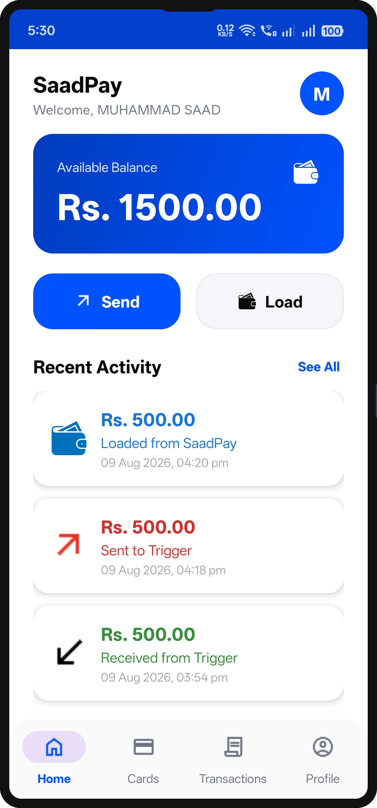
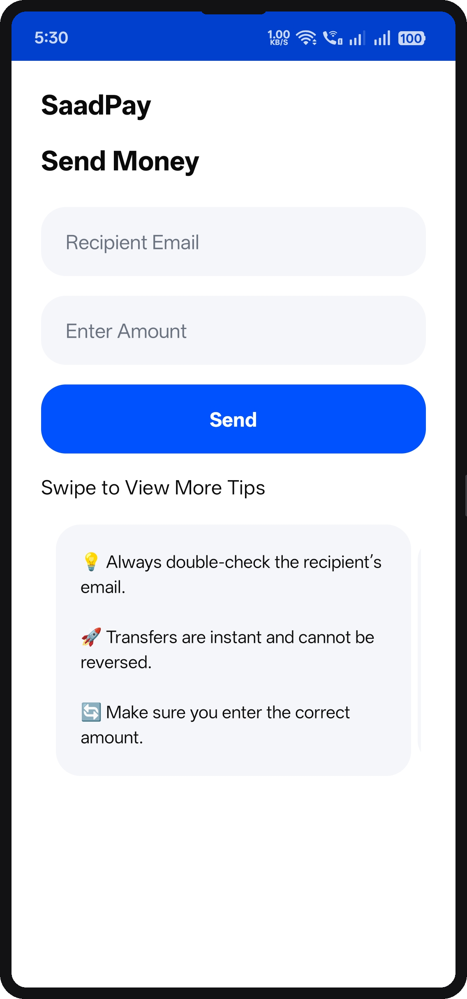
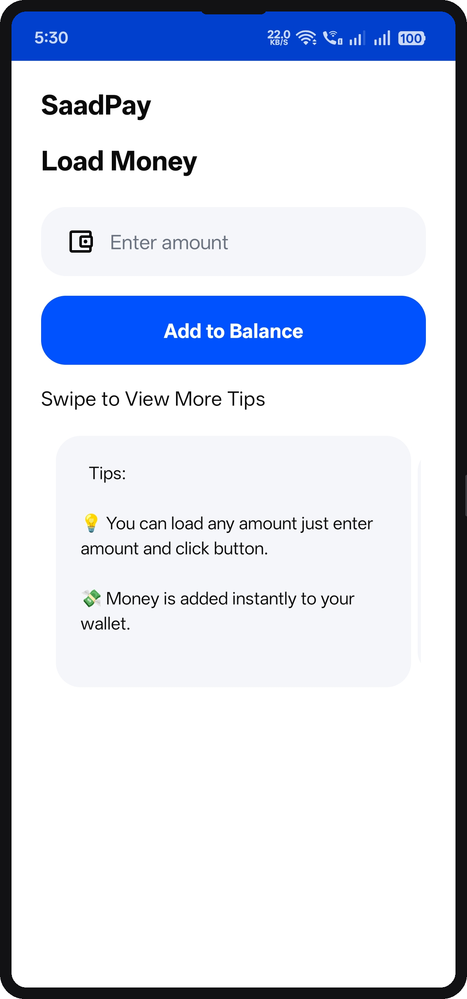
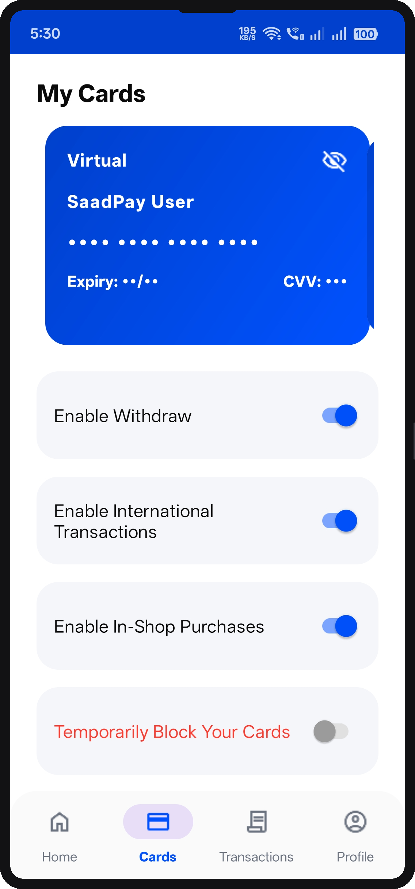
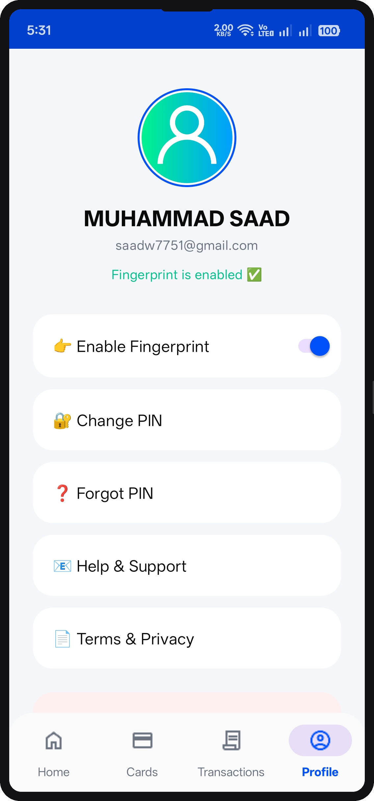

# SaadPay - Digital Wallet Application

SaadPay is a modern digital wallet application designed to simulate money transfers, balance tracking, and user account management. This project is strictly for educational and learning purposes. It is not a real banking or financial platform, and no real money transactions are involved.

## Screenshots

  
  
  
  
  
  

## Features

### Authentication and Security
* Login and Sign Up with Email and Password
* Email Verification support
* PIN Lock for secure application access
* Fingerprint (Biometric) Authentication
* Change PIN and Forgot PIN workflows

### Core Wallet Functionality
* Beautiful Dashboard showing user balance and quick actions
* Send Money to other SaadPay users
* Load Money into the simulated wallet
* Transaction History with detailed logs of sent, received, and loaded transactions

### Card Management
* Virtual and Physical Card screens
* Swipeable card interface
* Tap-to-reveal card credentials functionality

### Profile Management
* User Profile Screen (Profile image uploads currently restricted due to Firebase quota limits)

## Disclaimer

This application is developed purely for educational and learning purposes. It does not involve any real money or banking services. All functionalities are based on dummy data and Firebase backend integration for simulation only.

## Download

Download the latest version of SaadPay:
[Download SaadPay APK](https://github.com/chsaad-dev/saadpay/releases/latest)

* File: app-release.apk
* Version: v1.0
* Size: ~15 MB
* Requires: Android 5.0 (Lollipop) or higher

Note: To install, enable "Install from Unknown Sources" in your Android device settings.

## Built With

* Kotlin
* MVVM Architecture
* Firebase Authentication and Firestore
* Material Design 3
* ViewPager2 and Navigation Components

## Author

**Muhammad Saad**
* Email: saadw7751@gmail.com
* GitHub: [chsaad-dev](https://github.com/chsaad-dev)
* Portfolio: [saadev.site/](https://saadev.site/)

## License and Usage Restrictions

This project is licensed under the [MIT License](LICENSE).

This project is provided strictly for educational viewing purposes only.
You are not permitted to copy or re-upload this code to public repositories (like GitHub, GitLab, etc.) or modify and claim it as your own.
All rights are reserved by Muhammad Saad.
